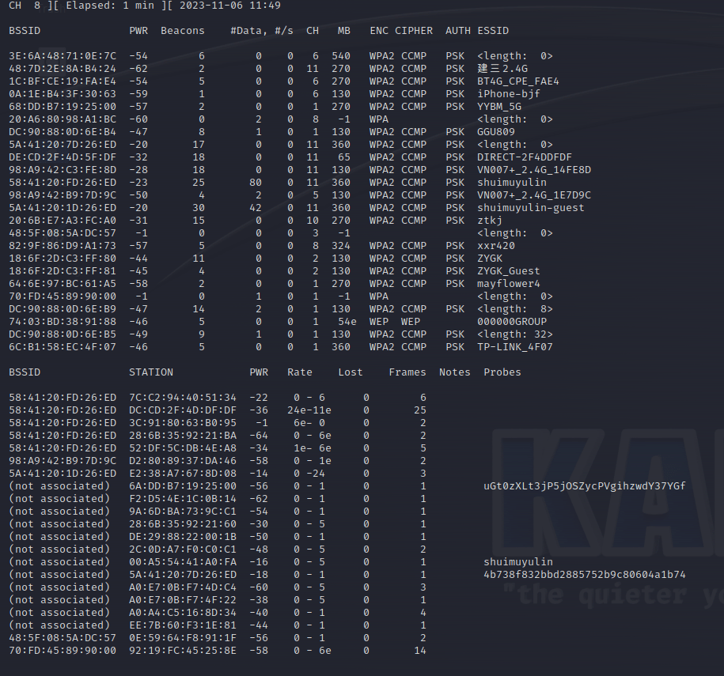
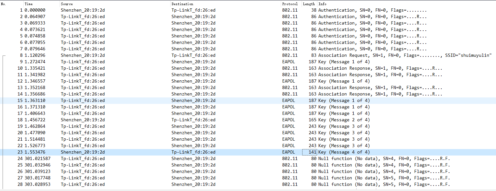

# 配置网卡
 1. 挂载usb网卡 (虚拟机->可移动设备->ralink 802.11 n WLAN)
 2. 配置网卡为monitor模式
    ```sh
    airmon-ng                   # 显示存在一个可用wifi设备
    airmon-ng start wlan0 6     # 设置wifi网卡进入monitor模式,网卡名称变为wlan0mon，同时设置channle 为6，和shuimuyulin同一频段      
    ```
 3. 测试是否支持注入        
  ```aireplay-ng -9 wlan0mon```
 4. 扫描周围Wi-Fi网络       
  ```airodump-ng wlan0mon```
  
 5. 配置网卡和网络频段一致，如网络显示为 Channel 6      
  ```airmon-ng start wlan0mon 10```     


# 安装依赖
```sh
pip uninstall pycrypto
pip install pycryptodome
```

# 运行后连接到 shuimuyulin
修改main.py中 def main() 的 WiFi_Object 和 config= 两处，然后运行
```python3 main.py```       
 

抓包截图        


    ```sh
    └─# /bin/python ./main.py
    -------------------------
    Link Authentication Request : 

    Scanning max 1 seconds for Authentication from BSSID 58:41:20:fd:26:ed
    .
    Sent 1 packets.
    Detected Authentication from Source 58:41:20:fd:26:ed

    -------------------------
    Link Authentication Response : 
    STA is authenticated to the AP!

    -------------------------
    Link Assocation Request : 

    Scanning max 1 seconds for Association Response from BSSID 58:41:20:fd:26:ed
    .
    Sent 1 packets.
    Detected Association Response from Source 58:41:20:fd:26:ed

    -------------------------
    Link Assocation Response : 
    STA is connected to the AP!

    -------------------------
    Key (Message 1 of 4): 
    RadioTap / Dot11 / LLC / SNAP / EAPOL EAPOL-Key / Raw
    ANonce ,  51fb8bd4b51261357fc9f34558825d74908f02c6e00c544a155894e37d438937

    -------------------------
    Key (Message 2 of 4): 
    PMK : 6190c13d8a4c8225723d80324491805d4456897f7067891aff85f29920221ca8
    PTK : 5874123e0cc46efc11f63c7f2b43211a4a7e44a1
    MIC : 9aa92f83a5efb4833206eb9dc4c4b14f
    .
    Sent 1 packets.

    -------------------------
    Key (Message 3 of 4): 
    RadioTap / Dot11 / LLC / SNAP / EAPOL EAPOL-Key / Raw
    Encrypt Msg :  0f77bb3d31d4da44391f7ce932da97839770566ea1ef357fb0ddae59c97376fcd8068ed372642cffabab45cc8a9433c9a705d0ade0501e23

    -------------------------
    Key (Message 4 of 4): 
    PMK : 6190c13d8a4c8225723d80324491805d4456897f7067891aff85f29920221ca8
    PTK : 5874123e0cc46efc11f63c7f2b43211a4a7e44a1
    MIC : 91a06cfb29bb7c4e05c33951f1f42f0f
    .
    Sent 1 packets.
    ```


# 如何排查网卡注入问题和其他
>Wi-Fi 帧注入的正确性 - XWiki   
>https://wiki.dev.shuimuyulin.com/xwiki/bin/view/Main/xfuzz-protocol/WIFI%20FUZZ/Wi-Fi%20%E5%B8%A7%E6%B3%A8%E5%85%A5%E7%9A%84%E6%AD%A3%E7%A1%AE%E6%80%A7/


# 运行和调试

## 命令行执行
使用python venv环境执行
scapy 2.4.5 版本有问题，提前确认版本
关闭其他影响包注入的程序
执行前需要确认网卡监听模式，且channel需要配置好
``` bash
sudo airmon-ng check
sudo airmon-ng check kill
sudo airmon-ng start wlan0 6
sudo ~/wifi-framework/setup/venv/bin/python3 ./main.py --help
sudo ~/wifi-framework/setup/venv/bin/python3 ./main.py --iface wlan0mon
```

## vscode 调试配置
可以在调试配置文件中传递入参

``` json : lauch.json
{
    // 使用 IntelliSense 了解相关属性。 
    // 悬停以查看现有属性的描述。
    // 欲了解更多信息，请访问: https://go.microsoft.com/fwlink/?linkid=830387
    "version": "0.2.0",
    "configurations": [
        {
            "name": "Python: shuimuyulin",
            "type": "python",
            "python": "/home/peter/project/wifi-framework/setup/venv/bin/python3",
            "request": "launch",
            "program": "${file}",
            "console": "integratedTerminal",
            "args": [
                "--iface",
                "wlan0mon",
                "--sta-mac",
                "00:1d:43:20:18:d4"
            ],
            "justMyCode": true,
        }
    ]
}
```
