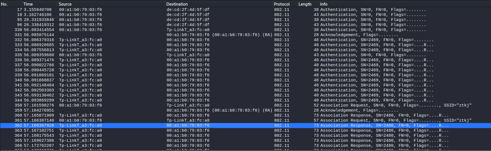

# 配置网卡
 1. 挂载usb网卡 (虚拟机->可移动设备->ralink 802.11 n WLAN)
 2. 配置网卡为monitor模式
    ```sh
    airmon-ng                   # 显示存在一个可用wifi设备
    airmon-ng start wlan0     # 设置wifi网卡进入monitor模式,网卡名称变为wlan0mon
    ```
 3. 测试是否支持注入        
  ```aireplay-ng -9 wlan0mon```
 4. 扫描周围Wi-Fi网络       
  ```airodump-ng wlan0mon```
 5. 配置网卡和网络频段一致，如网络显示为 Channel 10     
  ```airmon-ng start wlan0mon 10```

# 启动认证握手测试
```python3 wifi_connect.py```

启动后将连接到wifi ztkj     

      

抓包截图        



```sh
└─# /bin/python /code/contrib/wifi/wifi_connect.py
###[ 802.11 ]### 
  subtype   = Authentication
  type      = Management
  proto     = 0
  FCfield   = 
  ID        = 0
  addr1     = 20:6b:e7:a3:fc:a0 (RA=DA)
  addr2     = 00:a1:b0:79:03:f6 (TA=SA)
  addr3     = 20:6b:e7:a3:fc:a0 (BSSID/STA)
  SC        = 0
###[ 802.11 Authentication ]### 
     algo      = open
     seqnum    = 1
     status    = success


Scanning max 5 seconds for Authentication from BSSID 20:6b:e7:a3:fc:a0
.
Sent 1 packets.
Detected Authentication from Source 20:6b:e7:a3:fc:a0
STA is authenticated to the AP!
###[ 802.11 ]### 
  subtype   = Association Request
  type      = Management
  proto     = 0
  FCfield   = 
  ID        = 0
  addr1     = 20:6b:e7:a3:fc:a0 (RA=DA)
  addr2     = 00:a1:b0:79:03:f6 (TA=SA)
  addr3     = 20:6b:e7:a3:fc:a0 (BSSID/STA)
  SC        = 0
###[ 802.11 Association Request ]### 
     cap       = ESS+privacy
     listen_interval= 10
###[ 802.11 Information Element ]### 
        ID        = SSID
        len       = None
        info      = 'ztkj'


Scanning max 5 seconds for Association Response from BSSID 20:6b:e7:a3:fc:a0
.
Sent 1 packets.
Detected Association Response from Source 20:6b:e7:a3:fc:a0
STA is connected to the AP!
```